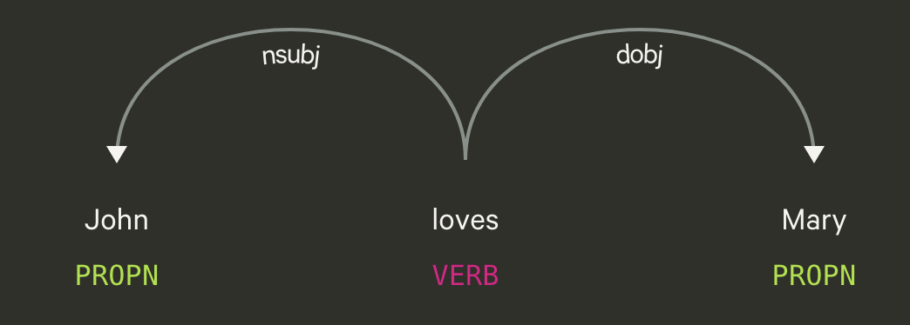

<!-- _class: title -->

# Marp 

## Slide Template

Date

Name
Affiliation

<!--
Speaker note:
Write speaker notes here.
They are not shown to the audience, but can be used in Presenter View or during HTML export.
-->

---
<!-- _class: intro -->

# 1. Introduction
## Text Style

- **Bold**
- ~~strikethrough~~
- _italic_
- > quote
- `inline code`
- ```Haskell
  import qualified Data.List as L
  import Data.Map
  ```
- $\KaTeX$


---
<!-- _class: background -->
# 2. Background
## Text Size

<div class = "three">
<div class ="huge">
huge
</div>
<div class = "large">
large
</div>
normal
<div class = "small">
small
</div>
<div class = "tiny">
tiny
</div>
</div>
<br>
<hr>
Heading
<div class = "two">

### \### a
#### \#### a
##### \##### a
###### \###### a
</div>


---
<!-- _class: method -->
# 3. Method
## Boxes and Columns

Two Column
<div class = "two">
  <div class = "box">
    box
  </div>
  
  <div class = "box">
    box
  </div>
</div>

<br>
Three Column
<div class = "three">
<div class = "bluebox">
blue box
</div>
<div class = "greenbox">
green box
</div>

<div class = "pinkbox">
pink box
</div>
</div>

---

<!-- _class: results -->
# 4. Results
## Table and Image
| Left align | Center align | Right align | 
| :--------- | :----------: | ----------: | 
| left       | center       | right       |


<div class ="two">

<div class = "small">
  
  - image
    - use *figure* (centerlize)
    <figure class ="fig">
      
      <figcaption> Figure 1. caption </figcaption>
    </figure>
    
    - import directly    
      
      <figcaption>Figure 2. caption</figcaption>

</div>


<div>

- drawio.svg


<figcaption> Figure 3. When <code>sample_diagram.drawio.svg</code> is edited with the VSCode draw.io extension, the changes are applied automatically. </figcaption>
</div>

---
<!-- _class: conclusion -->
# 5. Conclusion
## Marp CLI

<small>
Install:

```bash
npm install -g @marp-team/marp-cli
```

Preview / export:

```bash
marp slide_template.md --preview
marp slide_template.md -o slide_template.pdf
marp slide_template.md -o slide_template.html
marp slide_template.md -o slide_template.pptx
```

Export with local images:

```bash
marp slide_template.md --allow-local-files -o slide_template.pdf
```

Watch mode:

```bash
marp slide_template.md --watch
```
</small>